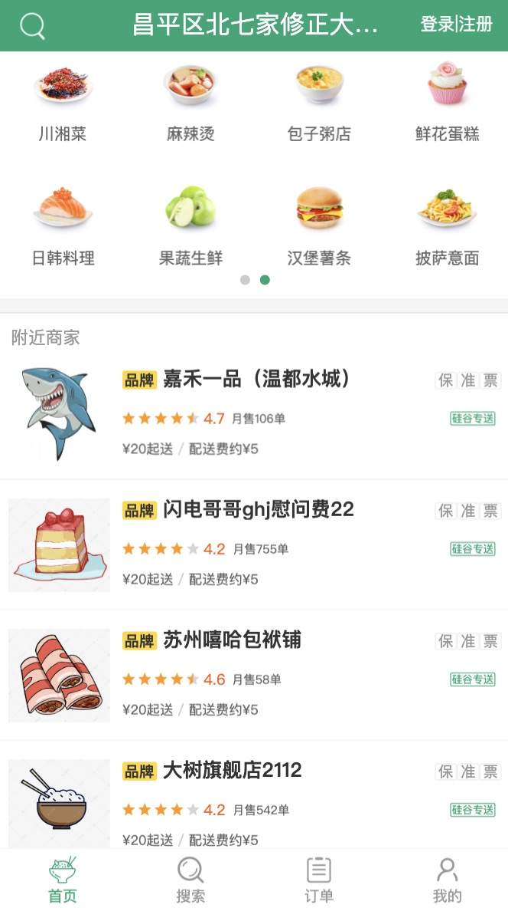
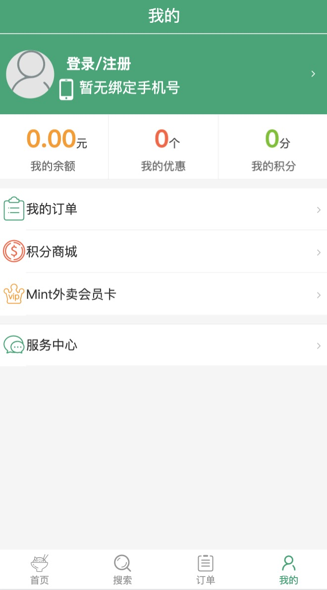
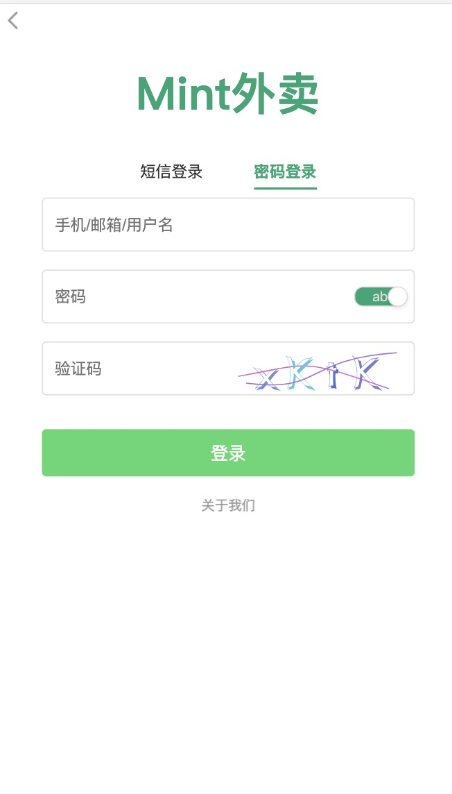
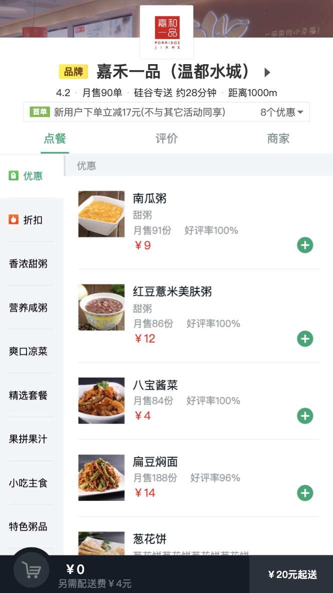

# 简介

## 1. 项目描述

1. 此项目为一个前后端分离的外卖 Web App (SPA) 项目
2. 使用了 Vue 全家桶+ES6+Webpack 等前端最新技术 
3. 包括商家, 商品, 购物车, 用户等多个功能子模块 
4. 采用模块化、组件化、工程化的模式开发 

## 2. 你能从此项目中学到什么? 

### 2.1 项目开发流程及开发方法 

1. 熟悉一个项目的开发流程
2. 学会组件化、模块化、工程化的开发模式 
3. 掌握使用 vue-cli 脚手架初始化 Vue.js 项目
4. 学会模拟 json 后端数据，实现前后端分离开发 
5. 学会 ES6+eslint 的开发方式 
6. 掌握一些项目优化技巧 

### 2.2 Vue 插件或第三方库

1. 学会使用 vue-router 开发单页应用 
2. 学会使用 axios/vue-resource 与后端进行数据交互
3. 学会使用 vuex 管理应用组件状态
4. 学会使用 better-scroll/vue-scroller 实现页面滑动效果
5. 学会使用 mint-ui 组件库构建界面
6. 学会使用 vue-lazyload 实现图片惰加载
7. 学会使用 mockjs 模拟后台数据接口  

## 3. API接口文档

[项目API接口文档](https://github.com/W-Qing/Vue-MintShop/blob/master/mintshop-server/API.md)

## 4. 项目开发

[完整项目开发流程说明文档](https://github.com/W-Qing/Vue-MintShop/blob/master/%E9%A1%B9%E7%9B%AE%E5%BC%80%E5%8F%91%E6%B5%81%E7%A8%8B.md)

## 5. 运行项目

**mintshop-client文件夹：**

1. `npm install`
2. `npm run dev`

开启服务端程序之前要先安装mongdb，并且成功打开数据库连接

**mintshop-server文件夹：**

1. `npm install`
2. `npm start`

## 6. App演示截图

